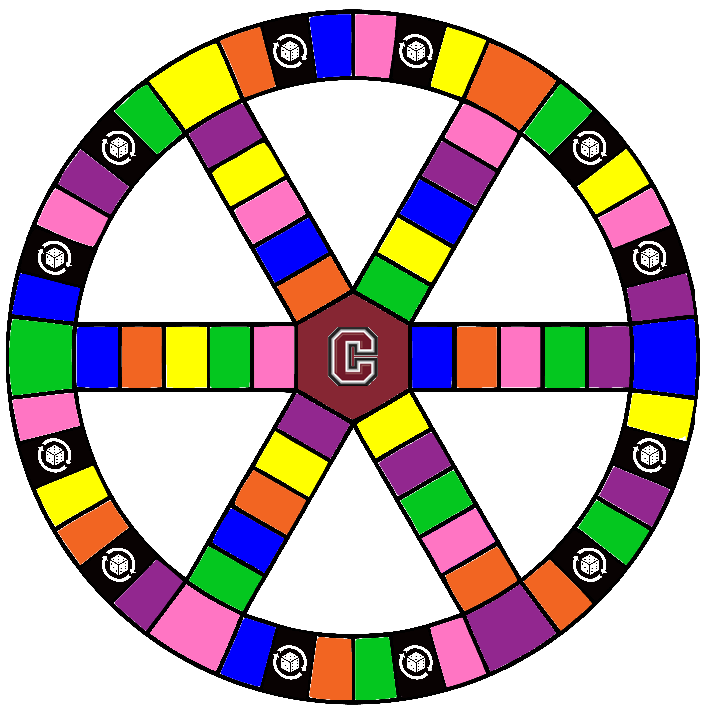

<!DOCTYPE html>
<html lang="en">
<head>
    <meta charset="UTF-8">
    <title>Trivial Pursuit: Covid Death Spiral Edition</title>

    <link rel="stylesheet" type="text/css" href="css/normalize.css">
    <link rel="stylesheet" type="text/css" href="css/gamepieces.css">
    <link rel="stylesheet" type="text/css" href="css/wedges.css">
    <link rel="stylesheet" type="text/css" href="css/game.css">

</head>
<body>
  

    

        

            

             

            <table id="score-table">
                <tr>
                    <th>Teams</th>
                    <th>
                        &#9660;
                        &#9660;
                        &#9660;
                        &#9660;
                        &#9660;
                        &#9660;
                    </th>
                </tr>
                <tr><td contenteditable="true" style="color:cornflowerblue">Player 1</td>  <td id="t0"></td></tr>
                <tr><td contenteditable="true" style="color:darkorange">Player 2</td>    <td id="t1"></td></tr>
                <tr><td contenteditable="true" style="color:deeppink">Player 3</td>       <td id="t2"></td></tr>
                <tr><td contenteditable="true" style="color:green">Player 4</td>         <td id="t3"></td></tr>
                <tr><td contenteditable="true" style="color:gold">Player 5</td>          <td id="t4"></td></tr>
                <tr><td contenteditable="true" style="color:red">Player 6</td>              <td id="t5"></td></tr>
            </table>

             

            <table id="dice-table">
                <tr>
                    <td></td>
                </tr>
            </table>

             
            <a class="left-link" href="howtoplay.html">How to play</a> 
            <a class="left-link" href="https://github.com/mb4828/trivialpursuit">Adapted From & Inspired By</a>

        

        

            

            <table id="pieces-table">
                <tr>
                    <td>

</td>
                    <td>

</td>
                    <td>

</td>
                    <td>

</td>
                    <td>

</td>
                    <!-- <td>

</td> -->
                </tr>
            </table>

            <!--
            
            
            
            
            -->
        

    

  

  
  
  

</body>
</html>
